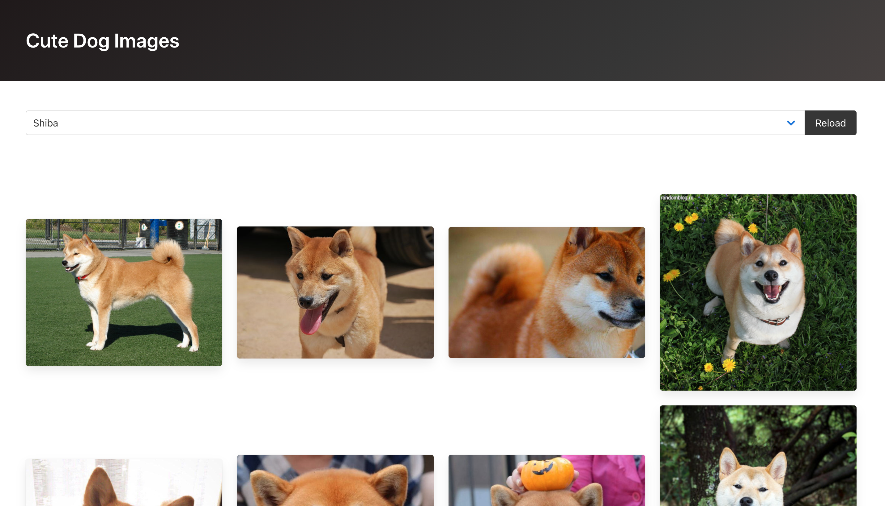

# 概要
以下の教材をやってみたリポジトリです。

[Reactチュートリアル1：犬画像ギャラリーを作ろう](https://zenn.dev/likr/articles/6be53ca64f29aa035f07)

※ 上記の教材は[@_likr](https://twitter.com/_likr)さんが[クリエイティブ・コモンズ 表示 4.0 国際 ライセンス](https://creativecommons.org/licenses/by/4.0/)で公開しています。

# 変更箇所
元の教材の回答コードから、以下を主に変更しています。
- TypeScriptを使用しています。
- 関数コンポーネントを使用しています。

# 実行方法

```shell
$ git clone git@github.com:delhi09/react_tutorial_nihon_u_1.git
$ cd react_tutorial_nihon_u_1
$ npm start
```

→ [http://localhost:3000](http://localhost:3000)でアプリが起動します。



